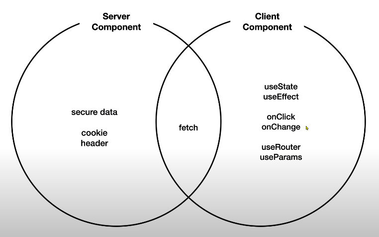
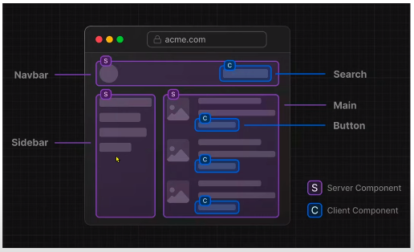
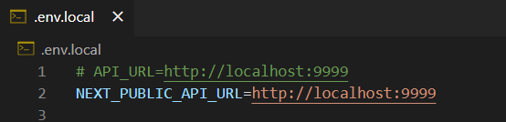

# Next.js 13 basics

> 본 공부는 생활코딩 강좌를 기반으로 작성됨 <br>
> https://opentutorials.org/course/5098

#### 터미널 입력 ( 설치 및 실행 )
```bash
# 설치
npm install 

# json server 설치, port는 9999 , watch로 상시 체크(watch 옵션을 주면 db.json파일이 수정되면 바로 서버가 재시동된다.)
# db.json 파일이 자동으로 생성된다. 
npx json-server --port 9999 --watch db.json

# 실행 
npm run dev
```

---

### 라우팅
create, read, update 폴더를 만든 후 page.js 파일을 만들면 바로 라우팅이 가능하다.

ex) 
<br>localhost:3000/create

---

### 동적 라우팅
read, create 폴더 안에 [id]폴더를 하나 더 만들면 다이나믹 라우팅이 가능하다.

ex) 
<br>localhost:3000/read/7
<br>localhost:3000/update/17 

---

### 서버 컴포넌트와 클라이언트 컴포넌트


- 서로 사용할 수 있는 api가 다르다
- 서버 컴포넌트에서 클라이언트 컴포넌트 api를 사용하면 에러가 발생한다 (상단에 'use client'를 작성해 클라이언트 컴포넌트로 변경해줘야 사용 가능)
- next.js에서 특별한 조치를 하지 않으면 server component로 간주한다

<br>


- 상기 이미지와 같이 사용자와 상호작용 하는 기능은 client component, 정보를 단순히 보여주는 역할을 하는 것은 server component로 구현하는 것이 유리하다

<br>

---

### 환경변수

- 기본적으로 환경변수에는 password와 같이 기밀이 포함될 가능성이 굉장히 높다. 비밀정보가 client component에 노출이 된다면, 정보가 브라우저에 전송될 것이고, 즉 유출이 된다는 뜻이다.
- 이러한 문제를 방지하기 위해서 환경변수는 server component에서만 접근이 가능하다.
- 웹 브라우저를 위한 환경변수를 사용하고 싶다면 NEXT_PUBLIC_ 접두사를 사용해야 한다.

<br>

---

