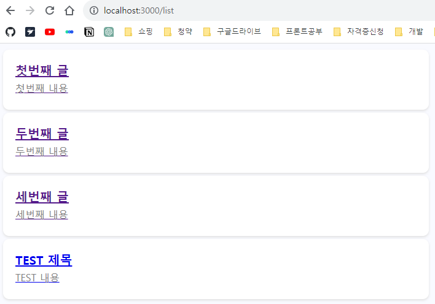
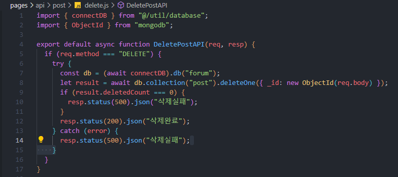

# Next.js 13 연습 - 게시판 구현
> stacks : Next.js, mongoDB
>
> 참고 : https://codingapple.com/course/next-js/
<br>

---

# Database
- 관계형 : PostgreSQL, MySQL, Oracle...
  - 데이터를 표로 저장 가능하다


- 비관계형 : mongoDB, Cloud firestore, cassandra...
  - 데이터 저장 방식이 자유롭다
  - 관계형 DB처럼 SQL문법이 필요없다 - 초심자들이 사용하기 좋다
  - 분산처리를 잘해준다 - 많은 입출력의 데이터 처리에 유용하다
  ```
  {
    data1 : content1,
    data2 : content2,
    data3 : content3,
  }
  ```
<br>

---

# mongoDB 사용
## 1. 세팅

- Database : 하나의 프로젝트
- Collection : 하나의 폴더 (내부에 document로 데이터를 저장)


- 예시 데이터 생성

## 2. 사용
```bash
# 터미널에서 mongoDB 설치
npm install mongodb
```

```js
// @/util/database.js
import { MongoClient } from 'mongodb';
const url = SERVER_URL;
const options = { useNewUrlParser: true };
let connectDB;

// Next.js는 코딩 후 파일을 저장하면 모든 JS파일 코드를 전부 다시 읽고 지나감
// 개발 단계에서 글로벌 변수에 저장 후 재사용을 위해 하기 코드를 작성 후 사용
if (process.env.NODE_ENV === 'development') {
  if (!global._mongo) {
    global._mongo = new MongoClient(url, options).connect()
  }
  connectDB = global._mongo
} else {
  connectDB = new MongoClient(url, options).connect()
}
export { connectDB }

```
- DB입출력 코드는 server component안에서만 사용하는 것이 옳다
- client component에서 작성 시 모든 코드가 유저 브라우저로 전송되기 때문에 좋지 않은 선택이다

<br>

---

# Client component 다이나믹 라우팅
```js
'use client'

import {usePathname, useSearchParams, useParams} from 'next/navigation'

export default function DetailLink(){
  let router = useRouter(); // 자바스크립트 코드로 페이지이동 구현
  let url = usePathname(); // 현재 URL
  let searchParams = useSearchParams() // search parameter(query string) 출력
  let params = useParams() // [dynamic route]에 입력한 url 파라미터, ex)/list/id -> (id 출력)
  return (
    <button onClick={()=>{ router.push('/주소') }}>버튼</button>
  )
}

/*
    1. router.push('/주소') : '/주소' 경로로 페이지 이동
    2. router.back() : 뒤로가기
    3. router.forward() : 앞으로가기 
    4. router.refresh() : soft refresh -> 이전과 바뀐점을 분석해서 바뀐 부분만 새로고침 
    5. router.prefetch('/주소') : '/주소'의 내용을 미리 로드해준다.
*/
```

<br>

---

# 3-tier architecture

- 유저가 정보를 입력하면 DB에 바로 저장하는 개발 방식은 X
- 중간에 프로그램(서버)을 하나 두어야 한다.
  - 글 작성 -> 서버에 글 저장 요청 -> 서버는 검사 후 DB에 저장

# Next.js에서 서버를 만들어보자
### 두 가지 방법이 있다.
1. app / api폴더에 서버 기능을 만드는 것이 더 신버전 방법이지만, 아직 완벽하지 않기 때문에, 2번 방법으로 개발해보자.
2. 루트 경로에 pages / api폴더 안에 서버 기능을 만들자.
- pages/api/sever.js를 생성 후 get방식으로 테스트를 해보자


- http://localhost:3000/api/server로 get방식 요청 시


- 정상적으로 동작한다, 다만 요청에 응답을 해주지 않으면  하기와 같이 무한로딩에 빠진다. 


- 이를 방지하기 위해선 응답 처리를 해줘야한다.


- 처리 성공 : status(200)
- 처리 실패 : status(500)
- 처리 실패(클라이언트쪽 실수) : status(400)
- 정확한 응답과 처리를 위해선 status code를 검색 후 사용하자


- 더 이상 무한 로딩이 되지 않는다, 응답도 잘 받는다.

# 글 작성 기능을 구현해보자

- POST 요청도 해보자.
- 가장 쉬운 방법은 form태그를 사용하는 것이다.
- form태그는 put과 delete는 사용할 수 없다.


- GET/POST방식에 따른 다른 응답이 가능하다.


- pages/api/post/new.js 에 서버 기능을 구현해보자. insertOne() api를 사용하면 새로운 글을 하나 저장할 수 있다.
- DB 다운, 인터넷 끊김 등의 DB쪽에서 에러가 발생할 수 있으니 try, catch문을 사용하자.
- 서버에서 validation을 체크하는 이유는, 프론트엔드에 있는 모든 것은 위조가 가능하기 때문에, 서버에서도 체크를 해야한다. 


- /write 페이지에서 내용을 작성 후 서버에 저장해보자.


- 작성완료 -> 저장 성공 시 /list 페이지로 리다이렉트
- 작성한 내용이 정상적으로 저장되고 리스트에 보여지는 것을 확인


- DB가 정상적으로 저장된 것을 확인

<br>

---

# 수정 기능을 구현해보자
1. 글마다 수정버튼, 클릭 시 수정페이지 이동
2. 수정페이지 진입 시 글 제목&내용이 채워져 있어야함
3. 수정완료 클릭 시 DB에 요청 및 DB글 수정


- updateOne({게시물정보(id)},{$set : {변경한 데이터}}) api를 사용하여 글 수정이 가능하다.
- 게시물정보, 즉 해당 id를 가져오려면 DB에서 가져오거나 클라이언트단에서 보내줘야 한다.
```jsx
// app/edit\[id]/page.js
  import { connectDB } from "@/util/database";
  import { ObjectId } from "mongodb";

  export default async function EditPage(props) {
    const db = (await connectDB).db("forum");
    let result = await db
      .collection("post")
      .findOne({ _id: new ObjectId(props.params.id) });

    return (
      <>
        <h4>글 수정</h4>
        <form action="/api/post/edit" method="POST">
          <input name="_id" defaultValue={result._id.toString()} style={{display:'none'}} />
          <input name="title" placeholder="title" defaultValue={result.title} />
          <input
            name="content"
            placeholder="content"
            defaultValue={result.content}
          />
          <button type="submit">수정 완료</button>
        </form>
      </>
    );
  }
```
- input태그에 id를 담아서 form태그 전송 시 같이 보내준다.
- id가 적혀있는 input 태그는 간단히 display:none 스타일 처리로 숨겨준다.
- input태그에서 value가 아닌 defaultValue를 사용한다. 기존 데이터를 쉽게 담을 수 있고, 수정도 가능하다!

# 삭제기능 구현 (ajax)

- list페이지에서 server component와 client component의 분리

```jsx
// app/list/ListItem.js
"use client";
import Link from "next/link";

export default function ListItem({ result }) {
  const deleteHandler = (_id, event) => {
    fetch("api/post/delete", {
      method: "DELETE",
      body: _id,
    })
      .then((res) => {
        // console.log(res)
        if (res.status === 200) {
          return res.json();
        } else {
          // 서버가 에러코드 전송 시 실행 코드
        }
      })
      .then((res) => {
        // 성공 시 실행 코드
        event.target.parentElement.style.opacity = 0; // 애니메이션 효과 천천히 사라짐
        setTimeout(() => {
          event.target.parentElement.remove(); // 1초 사라짐 애니메이션 효과 후 화면에서 삭제
        }, 1000);
      })
      .catch((error) => {
        // 인터넷문제로 실패 시 실행 코드
        console.log(error);
      });
  };

  return (
    <div className="list-bg">
      {result.map((e, i) => {
        return (
          <div className="list-item" id={e._id.toString()} key={i}>
            <Link prefetch={false} href={`/list/${e._id}`}>
              <h4>{e.title}</h4>
              <p>{e.content}</p>
            </Link>
            <Link href={`/edit/${e._id}`}>수정하기</Link>
            <button
              type="button"
              onClick={(event) => deleteHandler(e._id, event)}
            >
              삭제
            </button>
          </div>
        );
      })}
    </div>
  );
}
```
- app/list/page.js에 있던 list를 보여주는 코드를 ListItem 클라이언트 컴포넌트로 분리했다. 
- 이유는 삭제 기능 구현을 위해선 자바스크립트 코드가 필요한데, 자바스크립트 기능은 client component에서만 동작하기 때문이다.
- list페이지 전체를 client component로 변경해도 되지만, 그러면 sever component의 이점이 사라지기 때문에 분리한다.


- DB데이터 삭제는 deleteOne()을 사용하면 된다.

### query string 문법
- 서버로 데이터 전송은 ajax를 제외하고 query string문법과 URL parameter사용으로도 요청이 가능하다.
```js
  //서버로 요청 - url 작성 시 뒤에 물음표를 붙이고, 데이터이름=값 작성 후 전송(get요청도 가능)
  //단점 : query string이 길어지면 가독성이 떨어지고, id, password같은 민감한 데이터는 사용하면 안됨
  fetch('/api/post/delete?id=awlkfdsk&title=test&content=test')

  //서버에서 query string 출력
  console.log(요청.query)
```

### URL parameter 사용
- 서버에서도 URL parameter를 넣어두면 여러개의 서버 api를 한번에 만들 수 있다.


- 서버 URL을 만들 때 파일명에 []를 붙이면 '아무문자'라는 뜻
- api/abc/아무문자 경로로 get, post 요청 시 [id].js 안의 코드가 실행된다.
> ex)
>
> /api/abc/test1 <br>
> /api/abc/test2
- 이렇게 아무 데이터나 작성해도 [id].js 안의 코드가 실행된다.


# 배포

### Build 작업
- Next.js로 만든 서버를 배포하려면, 터미널에서 npm run build를 해야한다.
- 리액트 문법으로 작성된 코드를 브라우저 친화적인 html, css, js파일로 바꿔주는 작업이다.
- build 후 npm run start를 하면 실제로 유저 요청을 처리할 수 있는 next.js 서버가 완성된다.
- 실제 운영할 사이트라면 aws같은 클라우드에 올려서 npm run start를 해야한다.

### Dynamic rendering / static rendering
- Next.js 옛날 버전에선 SSG, ISR이었던 용어와 설명이 바뀌었다.
- Next.js에서는 페이지를 만들면 기본적으로 static rendering방식으로 페이지를 보여준다.
- 페이지 안에서 fetch라던지 이러한 함수가 없는 일반 페이지는 기본적으로 static rendering으로 동작한다.
- 그래서 유저가 접속할 때 미리 만들어둔 페이지를 보여준다. 그래서 매우 빠르게 페이지 전송이 가능하다.
- 하지만 페이지 안에 fetch('/URL', { cache: 'no-store' }) 로 데이터 가져오는 문법 / useSearchParams(), cookies(), headers() / [dynamic route] 등을 사용한다면 dynamic rendering으로 페이지를 보여준다.
- 상황에 따라서 다른 rendering 방식으로 페이지를 보여줘야 한다.


- npm run build를 하면 λ(람다)표시와 o표시가 나오는데, 람다는 dynamic, o는 static rendering이다.
- list 페이지가 지금 static rendering인데, list페이지에서는 작성, 삭제 후 페이지에 바로 반영이 되야하니, 강제로 dynamic rendering으로 변경해줘야 한다.
```jsx
// app/list/page.js
import { connectDB } from "@/util/database";
import ListItem from "./ListItem";

// 이 페이지를 보여줄 때 항상 dynamic rendering으로 보여준다
export const dynamic = 'force-dynamic'; 

export default async function ListPage() {
  const db = (await connectDB).db("forum");
  let result = await db.collection("post").find().toArray();

  return <ListItem result={result} />;
}
``` 
- export const dynamic = 'force-dynamic'; 를 페이지에 추가하면 된다. 'force-static'은 static rendering으로 실행해준다.
- dynamic rendering으로 동작하는 페이지가 많으면 서버 부담이 심해지는 단점이 있다.
- 이 경우에는 캐시 기능을 사용하며 자원을 아낄 수 있다.

### 캐싱
- 데이터를 저장해두었다가 재사용하는 기능
- Next.js에선 페이지 캐싱과 GET요청 결과 캐싱이 쉽게 가능하다.
- 1초마다 변하는 실시간 데이터를 보여주는 페이지의 경우 캐싱을 사용하면 안되지만, 대부분의 페이지들은 그렇지 않기 때문에 캐싱 기능을 사용하면 비용을 절약할 수 있다.
```js
// GET요청 결과 캐싱
let result = await fetch('/api/어쩌구', { cache: 'force-cache' })
```
- 컴포넌트 안에서 데이터를 가져올 때 fetch() api를 사용하면 캐싱기능을 자동으로 사용할 수 있는데, 그러면 fetch()를 할 때마다 서버에서 데이터를 가져오는게 아니라, 한 번 가져온 데이터를 저장해두었다가 재사용을 한다. -> 서버API가 DB응답을 기다릴 필요가 없기 때문에 더욱 빠르게 데이터를 가져올 수 있다.
- { cache: 'force-cache' } 옵션은 강제로 데이터를 캐싱해준다. /URL로 요청하면 항상 캐싱 결과를 가져온다. 해당 옵션은 디폴트값이기 때문에 굳이 적지 않아도 된다.

```js
fetch('/URL', { next: { revalidate: 60 } }) 
```
- 캐싱 결과를 60초 동안만 보관하고 사용한다.
- 60초가 지나면 다시 /URL로 새로 요청해서 결과를 가져오고 다시 캐싱한다.

```js
fetch('/URL', { cache: 'no-store' }) 
```
- 캐싱 기능을 사용하지 않는다.
- 항상 서버에서 데이터를 가져온다.
- 실시간 데이터가 중요할 때 사용한다.
- Next.js에서 fetch()가 업그레이드 상태라 사용 가능한 문법이다.
- server component에서만 캐싱기능을 사용 가능하다.

### 페이지단위 캐싱은 revalidate를 사용하자
```js
export const revalidate = 60;

export default function Page() {
  
  // DB 입출력 코드....

  return (
    <div></div>
  )
} 
```
- 파일 위쪽에 revalidate변수를 하나 만들고 원하는 초 단위를 집어넣으면 특정 페이지를 원하는 시간만큼 캐싱할 수 있다.
- 60초 동안 해당 페이지 접속 시 새로고침을 해도 캐싱 데이터를 사용한다.
- 60초가 지나면 페이지를 재생성해서 다시 캐싱한다. 
- *중요 : 유저가 글을 발행해도 60간 캐싱이 켜져있으면 페이지에 새 글이 보이지 않을 수도 있다. 이 문제는 on-demand revalidation을 꼭 찾아보도록 하자. 60초가 지난기 전에 강제로 명령이 가능하다.

### 참고사항

- 여러 컴포넌트에서 같은 /URL로 fetch를 하는 경우에 중복은 알아서 제거된다.
- 같은 /URL로 fetch()를 사용해도 문제가 되지 않는다는 뜻이다.
- 컴포넌트가 많은 경우 변수나 state공유 문제도 자동으로 해결된다.