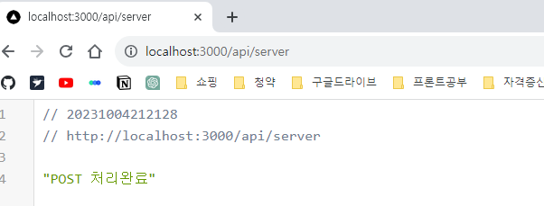
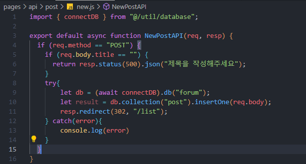

# Next.js 13 연습 - 게시판 구현
> stacks : Next.js, mongoDB
>
> 참고 : https://codingapple.com/course/next-js/
<br>

---

# Database
- 관계형 : PostgreSQL, MySQL, Oracle...
  - 데이터를 표로 저장 가능하다


- 비관계형 : mongoDB, Cloud firestore, cassandra...
  - 데이터 저장 방식이 자유롭다
  - 관계형 DB처럼 SQL문법이 필요없다 - 초심자들이 사용하기 좋다
  - 분산처리를 잘해준다 - 많은 입출력의 데이터 처리에 유용하다
  ```
  {
    data1 : content1,
    data2 : content2,
    data3 : content3,
  }
  ```
<br>

---

# mongoDB 사용
## 1. 세팅

- Database : 하나의 프로젝트
- Collection : 하나의 폴더 (내부에 document로 데이터를 저장)


- 예시 데이터 생성

## 2. 사용
```bash
# 터미널에서 mongoDB 설치
npm install mongodb
```

```js
// @/util/database.js
import { MongoClient } from 'mongodb';
const url = SERVER_URL;
const options = { useNewUrlParser: true };
let connectDB;

// Next.js는 코딩 후 파일을 저장하면 모든 JS파일 코드를 전부 다시 읽고 지나감
// 개발 단계에서 글로벌 변수에 저장 후 재사용을 위해 하기 코드를 작성 후 사용
if (process.env.NODE_ENV === 'development') {
  if (!global._mongo) {
    global._mongo = new MongoClient(url, options).connect()
  }
  connectDB = global._mongo
} else {
  connectDB = new MongoClient(url, options).connect()
}
export { connectDB }

```
- DB입출력 코드는 server component안에서만 사용하는 것이 옳다
- client component에서 작성 시 모든 코드가 유저 브라우저로 전송되기 때문에 좋지 않은 선택이다

<br>

---

# Client component 다이나믹 라우팅
```js
'use client'

import {usePathname, useSearchParams, useParams} from 'next/navigation'

export default function DetailLink(){
  let router = useRouter(); // 자바스크립트 코드로 페이지이동 구현
  let url = usePathname(); // 현재 URL
  let searchParams = useSearchParams() // search parameter(query string) 출력
  let params = useParams() // [dynamic route]에 입력한 url 파라미터, ex)/list/id -> (id 출력)
  return (
    <button onClick={()=>{ router.push('/주소') }}>버튼</button>
  )
}

/*
    1. router.push('/주소') : '/주소' 경로로 페이지 이동
    2. router.back() : 뒤로가기
    3. router.forward() : 앞으로가기 
    4. router.refresh() : soft refresh -> 이전과 바뀐점을 분석해서 바뀐 부분만 새로고침 
    5. router.prefetch('/주소') : '/주소'의 내용을 미리 로드해준다.
*/
```

<br>

---

# 3-tier architecture

- 유저가 정보를 입력하면 DB에 바로 저장하는 개발 방식은 X
- 중간에 프로그램(서버)을 하나 두어야 한다.
  - 글 작성 -> 서버에 글 저장 요청 -> 서버는 검사 후 DB에 저장

# Next.js에서 서버를 만들어보자
### 두 가지 방법이 있다.
1. app / api폴더에 서버 기능을 만드는 것이 더 신버전 방법이지만, 아직 완벽하지 않기 때문에, 2번 방법으로 개발해보자.
2. 루트 경로에 pages / api폴더 안에 서버 기능을 만들자.
- pages/api/sever.js를 생성 후 get방식으로 테스트를 해보자


- http://localhost:3000/api/server로 get방식 요청 시


- 정상적으로 동작한다, 다만 요청에 응답을 해주지 않으면  하기와 같이 무한로딩에 빠진다. 


- 이를 방지하기 위해선 응답 처리를 해줘야한다.


- 처리 성공 : status(200)
- 처리 실패 : status(500)
- 처리 실패(클라이언트쪽 실수) : status(400)
- 정확한 응답과 처리를 위해선 status code를 검색 후 사용하자


- 더 이상 무한 로딩이 되지 않는다, 응답도 잘 받는다.

# 글 작성 기능을 구현해보자

- POST 요청도 해보자.
- 가장 쉬운 방법은 form태그를 사용하는 것이다.
- form태그는 put과 delete는 사용할 수 없다.



- GET/POST방식에 따른 다른 응답이 가능하다.


- pages/api/post/new.js 에 서버 기능을 구현해보자. insertOne() api를 사용하면 새로운 글을 하나 저장할 수 있다.
- DB 다운, 인터넷 끊김 등의 DB쪽에서 에러가 발생할 수 있으니 try, catch문을 사용하자.
- 서버에서 validation을 체크하는 이유는, 프론트엔드에 있는 모든 것은 위조가 가능하기 때문에, 서버에서도 체크를 해야한다. 


- /write 페이지에서 내용을 작성 후 서버에 저장해보자.


- 작성완료 -> 저장 성공 시 /list 페이지로 리다이렉트
- 작성한 내용이 정상적으로 저장되고 리스트에 보여지는 것을 확인


- DB가 정상적으로 저장된 것을 확인

<br>

---

# 수정 기능을 구현해보자
1. 글마다 수정버튼, 클릭 시 수정페이지 이동
2. 수정페이지 진입 시 글 제목&내용이 채워져 있어야함
3. 수정완료 클릭 시 DB에 요청 및 DB글 수정


- updateOne({게시물정보(id)},{$set : {변경한 데이터}}) api를 사용하여 글 수정이 가능하다.
- 게시물정보, 즉 해당 id를 가져오려면 DB에서 가져오거나 클라이언트단에서 보내줘야 한다.
```jsx
// app/edit\[id]/page.js
  import { connectDB } from "@/util/database";
  import { ObjectId } from "mongodb";

  export default async function EditPage(props) {
    const db = (await connectDB).db("forum");
    let result = await db
      .collection("post")
      .findOne({ _id: new ObjectId(props.params.id) });

    return (
      <>
        <h4>글 수정</h4>
        <form action="/api/post/edit" method="POST">
          <input name="_id" defaultValue={result._id.toString()} style={{display:'none'}} />
          <input name="title" placeholder="title" defaultValue={result.title} />
          <input
            name="content"
            placeholder="content"
            defaultValue={result.content}
          />
          <button type="submit">수정 완료</button>
        </form>
      </>
    );
  }
```
- input태그에 id를 담아서 form태그 전송 시 같이 보내준다.
- id가 적혀있는 input 태그는 간단히 display:none 스타일 처리로 숨겨준다.
- input태그에서 value가 아닌 defaultValue를 사용한다. 기존 데이터를 쉽게 담을 수 있고, 수정도 가능하다!

# 삭제기능 구현 (ajax)

- list페이지에서 server component와 client component의 분리

```jsx
// app/list/ListItem.js
"use client";
import Link from "next/link";

export default function ListItem({ result }) {
  const deleteHandler = (_id, event) => {
    fetch("api/post/delete", {
      method: "DELETE",
      body: _id,
    })
      .then((res) => {
        // console.log(res)
        if (res.status === 200) {
          return res.json();
        } else {
          // 서버가 에러코드 전송 시 실행 코드
        }
      })
      .then((res) => {
        // 성공 시 실행 코드
        event.target.parentElement.style.opacity = 0; // 애니메이션 효과 천천히 사라짐
        setTimeout(() => {
          event.target.parentElement.remove(); // 1초 사라짐 애니메이션 효과 후 화면에서 삭제
        }, 1000);
      })
      .catch((error) => {
        // 인터넷문제로 실패 시 실행 코드
        console.log(error);
      });
  };

  return (
    <div className="list-bg">
      {result.map((e, i) => {
        return (
          <div className="list-item" id={e._id.toString()} key={i}>
            <Link prefetch={false} href={`/list/${e._id}`}>
              <h4>{e.title}</h4>
              <p>{e.content}</p>
            </Link>
            <Link href={`/edit/${e._id}`}>수정하기</Link>
            <button
              type="button"
              onClick={(event) => deleteHandler(e._id, event)}
            >
              삭제
            </button>
          </div>
        );
      })}
    </div>
  );
}
```
- app/list/page.js에 있던 list를 보여주는 코드를 ListItem 클라이언트 컴포넌트로 분리했다. 
- 이유는 삭제 기능 구현을 위해선 자바스크립트 코드가 필요한데, 자바스크립트 기능은 client component에서만 동작하기 때문이다.
- list페이지 전체를 client component로 변경해도 되지만, 그러면 sever component의 이점이 사라지기 때문에 분리한다.


- DB데이터 삭제는 deleteOne()을 사용하면 된다.

### query string 문법
- 서버로 데이터 전송은 ajax를 제외하고 query string문법과 URL parameter사용으로도 요청이 가능하다.
```js
  //서버로 요청 - url 작성 시 뒤에 물음표를 붙이고, 데이터이름=값 작성 후 전송(get요청도 가능)
  //단점 : query string이 길어지면 가독성이 떨어지고, id, password같은 민감한 데이터는 사용하면 안됨
  fetch('/api/post/delete?id=awlkfdsk&title=test&content=test')

  //서버에서 query string 출력
  console.log(요청.query)
```

### URL parameter 사용
- 서버에서도 URL parameter를 넣어두면 여러개의 서버 api를 한번에 만들 수 있다.


- 서버 URL을 만들 때 파일명에 []를 붙이면 '아무문자'라는 뜻
- api/abc/아무문자 경로로 get, post 요청 시 [id].js 안의 코드가 실행된다.
> ex)
>
> /api/abc/test1 <br>
> /api/abc/test2
- 이렇게 아무 데이터나 작성해도 [id].js 안의 코드가 실행된다.


# 배포

### Build 작업
- Next.js로 만든 서버를 배포하려면, 터미널에서 npm run build를 해야한다.
- 리액트 문법으로 작성된 코드를 브라우저 친화적인 html, css, js파일로 바꿔주는 작업이다.
- build 후 npm run start를 하면 실제로 유저 요청을 처리할 수 있는 next.js 서버가 완성된다.
- 실제 운영할 사이트라면 aws같은 클라우드에 올려서 npm run start를 해야한다.

### Dynamic rendering / static rendering
- Next.js 옛날 버전에선 SSG, ISR이었던 용어와 설명이 바뀌었다.
- Next.js에서는 페이지를 만들면 기본적으로 static rendering방식으로 페이지를 보여준다.
- 페이지 안에서 fetch라던지 이러한 함수가 없는 일반 페이지는 기본적으로 static rendering으로 동작한다.
- 그래서 유저가 접속할 때 미리 만들어둔 페이지를 보여준다. 그래서 매우 빠르게 페이지 전송이 가능하다.
- 하지만 페이지 안에 fetch('/URL', { cache: 'no-store' }) 로 데이터 가져오는 문법 / useSearchParams(), cookies(), headers() / [dynamic route] 등을 사용한다면 dynamic rendering으로 페이지를 보여준다.
- 상황에 따라서 다른 rendering 방식으로 페이지를 보여줘야 한다.


- npm run build를 하면 λ(람다)표시와 o표시가 나오는데, 람다는 dynamic, o는 static rendering이다.
- list 페이지가 지금 static rendering인데, list페이지에서는 작성, 삭제 후 페이지에 바로 반영이 되야하니, 강제로 dynamic rendering으로 변경해줘야 한다.
```jsx
// app/list/page.js
import { connectDB } from "@/util/database";
import ListItem from "./ListItem";

// 이 페이지를 보여줄 때 항상 dynamic rendering으로 보여준다
export const dynamic = 'force-dynamic'; 

export default async function ListPage() {
  const db = (await connectDB).db("forum");
  let result = await db.collection("post").find().toArray();

  return <ListItem result={result} />;
}
``` 
- export const dynamic = 'force-dynamic'; 를 페이지에 추가하면 된다. 'force-static'은 static rendering으로 실행해준다.
- dynamic rendering으로 동작하는 페이지가 많으면 서버 부담이 심해지는 단점이 있다.
- 이 경우에는 캐시 기능을 사용하며 자원을 아낄 수 있다.

### 캐싱
- 데이터를 저장해두었다가 재사용하는 기능
- Next.js에선 페이지 캐싱과 GET요청 결과 캐싱이 쉽게 가능하다.
- 1초마다 변하는 실시간 데이터를 보여주는 페이지의 경우 캐싱을 사용하면 안되지만, 대부분의 페이지들은 그렇지 않기 때문에 캐싱 기능을 사용하면 비용을 절약할 수 있다.
```js
// GET요청 결과 캐싱
let result = await fetch('/api/어쩌구', { cache: 'force-cache' })
```
- 컴포넌트 안에서 데이터를 가져올 때 fetch() api를 사용하면 캐싱기능을 자동으로 사용할 수 있는데, 그러면 fetch()를 할 때마다 서버에서 데이터를 가져오는게 아니라, 한 번 가져온 데이터를 저장해두었다가 재사용을 한다. -> 서버API가 DB응답을 기다릴 필요가 없기 때문에 더욱 빠르게 데이터를 가져올 수 있다.
- { cache: 'force-cache' } 옵션은 강제로 데이터를 캐싱해준다. /URL로 요청하면 항상 캐싱 결과를 가져온다. 해당 옵션은 디폴트값이기 때문에 굳이 적지 않아도 된다.

```js
fetch('/URL', { next: { revalidate: 60 } }) 
```
- 캐싱 결과를 60초 동안만 보관하고 사용한다.
- 60초가 지나면 다시 /URL로 새로 요청해서 결과를 가져오고 다시 캐싱한다.

```js
fetch('/URL', { cache: 'no-store' }) 
```
- 캐싱 기능을 사용하지 않는다.
- 항상 서버에서 데이터를 가져온다.
- 실시간 데이터가 중요할 때 사용한다.
- Next.js에서 fetch()가 업그레이드 상태라 사용 가능한 문법이다.
- server component에서만 캐싱기능을 사용 가능하다.

### 페이지단위 캐싱은 revalidate를 사용하자
```js
export const revalidate = 60;

export default function Page() {
  
  // DB 입출력 코드....

  return (
    <div></div>
  )
} 
```
- 파일 위쪽에 revalidate변수를 하나 만들고 원하는 초 단위를 집어넣으면 특정 페이지를 원하는 시간만큼 캐싱할 수 있다.
- 60초 동안 해당 페이지 접속 시 새로고침을 해도 캐싱 데이터를 사용한다.
- 60초가 지나면 페이지를 재생성해서 다시 캐싱한다. 
- *중요 : 유저가 글을 발행해도 60간 캐싱이 켜져있으면 페이지에 새 글이 보이지 않을 수도 있다. 이 문제는 on-demand revalidation을 꼭 찾아보도록 하자. 60초가 지난기 전에 강제로 명령이 가능하다.

### 참고사항

- 여러 컴포넌트에서 같은 /URL로 fetch를 하는 경우에 중복은 알아서 제거된다.
- 같은 /URL로 fetch()를 사용해도 문제가 되지 않는다는 뜻이다.
- 컴포넌트가 많은 경우 변수나 state공유 문제도 자동으로 해결된다.

<br>

---

# 회원기능 

### Session 방식
- 유저가 로그인하면 DB에 유저 아이디, 로그인 날짜, 유효기간, session id를 기억해두고 유저에게는 (입장권)session id 하나만 보낸다.
- 유저가 GET/POST 요청 시 입장권을 서버에 제출 후 서버는 입장권을 가지고 DB 조회 후 DB기록에 이상이 없으면 GET/POST요청을 진행시켜 준다.
- 장점 : 
  - 매번 GET/POST 요청 시 매번 DB를 조회하기 때문에 엄격하게 유저를 체크 가능
- 단점 :
  - 그만큼 DB부담이 심해짐 - 그래서 유저가 많은 사이트들은 조금 더 빠른 Redis같은 DB를 사용하기도 한다.

### Token 방식
- 대부분 JWT(JSON Web Token)라고 한다.
- 유저가 로그인하면 유저에게 입장권(유저 아이디, 로그인 날짜, 유효기간)등을 암호화해서 보낸다. DB에 저장은 하지 않는다.
- 유저가 GET/POST 요청 시 입장권을 확인하고 이상 없으면 바로 진행.
- JWT는 여러 정보들을 짧은 문자로 변환/암호화해서 만드는데, 변경/위조가 되면 짧은 문자도 변하기 때문에 위조여부를 쉽게 알 수 있어 걱정 안해도 된다.
- 장점 : 
  - 매번 GET/POST 요청 시 DB조회가 필요 없다. -> DB 부담이 적다. 유저가 많은 사이트들이 즐겨쓴다.
- 단점 :
  - 유저의 JWT를 훔쳐가면 훔친 사람의 로그인을 막을 수 있는 방법이 없다. 다른 컴퓨터에 저장된 JWT를 소멸시키거나 하는 방법은 없기 때문에, 다른 컴퓨터 접속을 막거나 로그아웃 시키는 것도 어렵다.
  - 이런 JWT들을 모아서 DB같은 곳에 기록해두고 확인해도 되지만, 그러면 매번 JWT 사용 때 DB를 조회해야 하니 session방식과 다른점이 없어진다.

### OAuth
- OAuth는 유저의 A사이트 사용 권한을 B사이트를 운영하는 곳에서 잠시 빌려 사용하는 방법, 규칙같은 것이다.
- 흔히 소셜로그인이라고 부른다.

### Next-Auth(Auth.js) 라이브러리
- JWT또는 OAuth를 사용해서 회원기능을 매우 쉽게 만들 수 있게 도와주는 라이브러리이다.
- 라이브러리를 설치하고 코드만 복붙하면 회원기능 구현이 끝나 쉽고 빠르다.
- 소셜로그인, 아이디/비번 로그인 전부 구현이 가능하다.
- JWT/session 방식 구현도 가능하다.
- DB adapter기능을 이용하면 DB에 session을 저장해두고 유저 관리도 가능하다.
- 단점 :
  - 아이디/비번으로 로그인하는 옵션을 켜둔 경우에는 JWT방식을 강제로 사용해야 한다.
  - session방식은 사용이 불가능하다. -> 개발자가 직접 아이디/비번을 관리하면 복잡하고 보안이슈가 생길 수 있기 때문이다.

<br>

---

# 소셜로그인 구현
### 깃헙 로그인
- Github 앱을 먼저 생성해야한다.
- Github.com 로그인 후 메뉴버튼 클릭 -> Settings -> Developer settings -> New OAuth app 에서 만든다.


- Github에 있는 유저의 개인정보 조회 권한을 잠깐 위임받아야 하기 때문에 만들어두어야 한다.


- 주소와 이름을 적어야 한다.


- ID와 Secret키를 발급받은 후 secret키는 이후에 다시 볼 수 없다고 경고 메시지가 뜬다. 작 적어두자.

### NextAuth 라이브러리 셋팅

```bash
  # 라이브러리 설치 
  npm install next-auth
```

```jsx
import NextAuth from "next-auth";
import GithubProvider from "next-auth/providers/github";

export const authOptions = {
  providers: [
    GithubProvider({
      clientId: '깃헙에서 발급받은 ID',
      clientSecret: '깃헙에서 발급받은 Secret Key',
    }),
    // GoogleProvider({
    //   clientId: '',
    //   clientSecret: '',
    // }),
  ],
  secret : 'JWT생성 시 사용할 암호'
};
export default NextAuth(authOptions); 
```
- pages/api/auth/[...nextauth].js 경로에 해당 파일을 만들고 상단 코드를 작성해두면 셋팅이 끝난다.
- Github에서 발급받은 ID와 Secret Key를 잘 입력해주자.
- 소셜로그인은 기본적으로 JWT방식이 기본이라 secret에 JWT생성용 암호도 잘 입력해두자.
- 암호는 .env파일에 적어두고 사용하면 더 안전하다.
  
### 로그인 페이지, 로그인/로그아웃 버튼 및 기능

```jsx
// layout.js
import Link from "next/link";
import "./globals.css";
import { getServerSession } from "next-auth";
import { authOptions } from "@/pages/api/auth/[...nextauth]";
import LoginBtn from "./Loginbtn";
import LogoutBtn from "./LogoutBtn";

export const metadata = {
  title: "OnlineBoard",
  description: "online board",
};

export default async function RootLayout({ children }) {
  const userSession = await getServerSession(authOptions); //서버컴포넌트, 서버기능안에서 사용 가능한 함수
  console.log("userSession", userSession);
  return (
    <html>
      <body>
        <div className="navbar">
          <Link href="/" className="logo">
            ForumLogo
          </Link>
          <Link href="/list">List</Link>
          <Link href="/write">Write</Link>
          {userSession ? <LogoutBtn /> : <LoginBtn /> }
        </div>
        {children}
      </body>
    </html>
  );
}
```
- userSession 유무에 따라 로그인/로그아웃 버튼 보여주기

```jsx
// 로그인
"use client";
import { signIn } from "next-auth/react";

export default function LoginBtn() {
  return (
    <button onClick={() => {signIn()}}> 
      로그인 
    </button>
  );
}
```
- 로그인/로그아웃 버튼에 onClick을 사용해야 하니 따로 client component를 만들어 구현하고 import로 사용하자.
- onClick에 signIn/signOut만 사용하면 간단히 로그인/로그아웃 기능 구현이 완료된다.
- 잊지말고 import 하자
```jsx
const userSession = await getServerSession(authOptions)
```
- 상단 코드는 server component의 경우에만 사용 가능하다.
- client component에서 사용하려면 하기 코드를 사용해야 한다.
```jsx
// layout.js
'use client'

import { SessionProvider } from "next-auth/react"

export default function Layout({ children }){
  return (
    <SessionProvider>
      {children}
    </SessionProvider>
  )
}
```
- `<SessionProvider>`를 import하고 부모 컴포넌트를 감싸면 자식 컴포넌트들에서 `useSession()`이라는 함수를 이용하여 사용이 가능하다. 
```jsx
// page.js
'use client'

import { useSession } from 'next-auth/react'

export default function Page(){
  let session  = useSession();
  if (session) {
    console.log(session)
  }
  
  // (생략)
```
- 보통 server compoennt에서 유저 정보를 가져와서 client component로 전송해주는 게 나을 수 있다.
- 이유는 useSession함수는 html이 다 보여지고 그 후 한 박자 늦게 실행될 수 있다.

### 소셜 로그인 단점
- 제3자의 사이트에 의존하는 방법이기 때문에
  - 시간이 흐르고 해당 사이트의 사용량이 적어지면 소셜로그인 사용이 애매해질 수 있고
  - 예전에 발생했던 카카오톡 서버 화재 사태처럼 해당 사이트에 문제가 생기면 소셜로그인 사용이 불가하다.

### OAuth + session방식 사용 (JWT방식 X)
- DB adapter를 사용해야 한다.
- DB adapter 사용 시
  - 첫 로그인 시 자동회원가입(DB에 보관)
  - 로그인 시 DB에 세션정보 보관
  - 현재 로그인된 유저정보가 필요하면 DB에 조회해서 확인

```bash
# mongoDB adapter 설치
npm install @next-auth/mongodb-adapter 
```
- mongoDB말고 다른 DB에 유저 세션을 저장하고 싶다면 다른 DB adapter를 찾아서 사용하면 된다.
- redis같은 것을 사용하면 데이터 저장 시 하드말고 램을 사용하기 때문에 빨라서 session 방식을 구현할 때 인기가 좋다.


- `adapter : MongoDBAdapter(connectDB),`를 추가해주자.


- 로그인해보면 mongoDB에 3개의 컬렉션이 생성된다.
- sessions : 현재 로그인된 유저 정보가 들어있다.
- users : 유저들을 보관하는 곳이다. 유저끼리는 이메일로 구분한다.
- accounts : 유저 계정을 보관하는 곳이다.
- 하나의 유저는 여러개의 계정을 가지고 있을 수 있기 때문에 여러 계정마다 이메일이 중복될 수 있다.

### user vs accounts 차이
- 1명의 유저가 사이트에 github, google가입 전부를 했을 때, 계정이 둘 다 example@naver.com으로 되어있을 때, user 컬렉션에 example@naver.com 이메일을 가진 document가 1개만 생성이된다.
- accounts 컬렉션에는
  - example@naver.com + Github이 써있는 document 
  - example@naver.com + Google이 써있는 document 
  - 이렇게 두 가지가 생성된다.
- 유저는 1명이지만 계정은 2개 이상 생성이 가능하다.(이메일이 같으면 같은 유저라고 자동으로 간주된다.)

### 회원 로그인 후 새로운 글 생성
```jsx
// new.js 수정

export default async function NewPostAPI(req, resp) {
  // 하기 코드 추가
  const userSession = await getServerSession(req, resp, authOptions);
  if (userSession) {
    // author 추가 (글 생성자가 누구인지 확인용, 이후 수정 삭제 때도 사용)
    req.body.author = userSession.user.email;
  }
  
  // 기존 코드
  if (req.method === "POST") {
    if (req.body.title === "") {
      return resp.status(500).json("제목을 작성해주세요");
    }
    try {
      let db = (await connectDB).db("forum");
      let result = db.collection("post").insertOne(req.body);
      resp.redirect(302, "/list");
    } catch (error) {
      console.log(error);
    }
  }
}
```

### 회원 로그인 후 글 삭제
```jsx
// delete.js 삭제

export default async function DeletePostAPI(req, resp) {
  if (req.method === "DELETE") {
    try {
      const userSession = await getServerSession(req, resp, authOptions);
      const db = (await connectDB).db("forum");
      let checkUser = await db
        .collection("post")
        .findOne({ _id: new ObjectId(req.body) });
      if (userSession && checkUser.author === userSession.user.email) {
        let result = await db
          .collection("post")
          .deleteOne({ _id: new ObjectId(req.body) });
        if (result.deletedCount === 0) {
          console.log("1");
          return resp.status(500).json("삭제실패");
        } else {
          console.log("2");
          return resp.status(200).json("삭제완료");
        }
      } else {
        console.log("3");
        return resp.status(500).json("작성자와 현재 유저 불일치");
      }
    } catch (error) {
      console.log("4");
      resp.status(500).json("삭제실패");
    }
  }
}
```

### 아이디/비번 + JWT 사용 회원기능 만들기
- 아이디/비번 방식으로 로그인하고 싶다면 Next-auth 라이브러리 설정에서 Credentials provider를 선택하면 된다.
- 이 경우 session방식 말고 강제로 JWT방식을 사용하도록 세팅되어있다.
  - 회원가입 페이지에서 유저가 아이디/비밀번호를 서버로 제출하면
  - 서버는 그걸 DB에 저장한다
- 이대로 구현해보자.

### 회원가입 페이지에서 유저가 아이디/비밀번호 작성

```jsx
// app/register/page.js

export default function Register() {
  return (
    <div>
        <form method="POST" action="/api/auth/signup">
          <input name="name" type="text" placeholder="이름" /> 
          <input name="email" type="text" placeholder="이메일" />
          <input name="password" type="password" placeholder="비번" />
          <button type="submit">id/pw 가입요청</button>
        </form>
    </div>
  )
}
```
- 요즘은 아이디 대신 이메일을 사용하는 것이 대세다.
- 일종의 일관성 유지 용도라고 한다.

### 서버로 DB에 저장
```bash
  # 비밀번호를 암호화해서 저장해야 되기 때문에 설치
  npm install bcrypt
```
```jsx
import { connectDB } from "@/util/database";
import bcrypt from 'bcrypt'

export default async function SignupAPI(req, resp) {
    if(req.method === 'POST'){
        const hash = await bcrypt.hash(req.body.password, 10) // 암호화, 10은 암호화정도-수정가능
        req.body.password = hash; //암호화 후 다시 비밀번호에 넣는다. -> DB에 암호화한 상태로 저장
        let db = (await connectDB).db('forum')
        await db.collection('user_cred').insertOne(req.body)
        resp.status(200).json('가입성공');
    }
}
```

### Credentails provider 설정
```jsx
// [...nextauth].js

import NextAuth from "next-auth";
import GithubProvider from "next-auth/providers/github";
import CredentialsProvider from "next-auth/providers/credentials";
import bcrypt from 'bcrypt';
import { connectDB } from "@/util/database";

// 하기 코드는 mongoDB adapter 사용 시 선언
// import { MongoDBAdapter } from "@next-auth/mongodb-adapter";

export const authOptions = {
  providers: [
    GithubProvider({
      clientId: process.env.CLIENT_ID,
      clientSecret: process.env.CLIENT_SECRET,
    }),
    CredentialsProvider({
      //1. 로그인페이지 폼 자동생성해주는 코드
      name: "credentials",
        credentials: {
          email: { label: "email", type: "text" },
          password: { label: "password", type: "password" },
      },

      //2. 로그인요청시 실행되는코드
      //직접 DB에서 아이디,비번 비교하고
      //아이디,비번 맞으면 return 결과, 틀리면 return null 해야함
      async authorize(credentials) {
        let db = (await connectDB).db('forum');
        let user = await db.collection('user_cred').findOne({email : credentials.email})
        if (!user) {
          console.log('해당 이메일은 없음');
          return null
        }
        const pwcheck = await bcrypt.compare(credentials.password, user.password);
        if (!pwcheck) {
          console.log('비번틀림');
          return null
        }
        return user
      }
    }),
  ],

  //3. jwt 써놔야 잘됩니다 + jwt 만료일설정
  session: {
    strategy: "jwt",
    maxAge: 30 * 24 * 60 * 60, //30일 (로그인 상태 유지 기간 - 하루는 24 * 60 * 60)
  },

  callbacks: {
    //4. jwt 만들 때 실행되는 코드
    //user변수는 DB의 유저정보담겨있고 token.user에 뭐 저장하면 jwt에 들어갑니다.
    jwt: async ({ token, user }) => {
      if (user) {
        // JWT에 기입할 정보, 어떤 정보들을 jwt에 담아서 유저에게 보낼지
        token.user = {};
        token.user.name = user.name;
        token.user.email = user.email;
      }
      return token;
    },

    //5. 유저 세션이 조회될 때 마다 실행되는 코드
    // 컴포넌트에서 유저의 session 데이터를 출력할 떄, 어떤 데이터를 출력 가능하게 할지
    session: async ({ session, token }) => {
      session.user = token.user; //유저 모든 정보
      return session;
    },
  },

  secret: process.env.SECRET_KEY,
  // mongoDB adapter 사용
  // adapter : MongoDBAdapter(connectDB), // 추가
};
export default NextAuth(authOptions);
```
- 라이브러리 사용법이기 때문에 외워서 공부할 필요는 없다. 그대로 복붙해서 사용해도 문제없다.
- 가장 중요한 것은 2번이고, 로그인 시 아이디/비밀번호를 DB에 저장된 내용과 비교하는건 개발자가 직접 해야하니 DB상황에 맞게 수정해서 사용하자.

<br>

---

# 댓글 기능 만들기 - 조회, 생성
- client component로 만들어보자.
- client-side rendering을 하면 브라우저에서 html을 생성, 수정, 삭제를 해줄 수 있기 때문에 부드럽고 이쁜 사이트를 만들 수 있다. 단점은 검색노출인데, 댓글 기능이라 별로 상관 없을 것 같다.
  - 유저가 댓글 작성 및 전송
  - 서버로 보내서 DB에 댓글 저장, 끝.

### 댓글 UI, 댓글 내용 서버로 전송
```jsx
// list/[id]/page.js

export default async function ListDetailPage(props) {
  const db = (await connectDB).db("forum");
  let result = await db
    .collection("post")
    .findOne({ _id: new ObjectId(props.params.id) });
  return (
    <>
      <div>상세페이지</div>
      <h4>{result.title}</h4>
      <p>{result.content}</p>
      <Comment id={result._id.toString()}/> 
    </>
  );
}
```
```jsx
// list/[id]/Comment.js

"use client";
import { useEffect, useState } from "react";

export default function Comment(props) {
  const [comment, setComment] = useState("");
  useEffect(() => {
    fetch();
  }, []);
  return (
    <div>
      <p>댓글목록</p>
      <input
        placeholder="comment"
        onChange={(e) => {
          setComment(e.target.value);
        }}
      />
      <button
        onClick={() => {
          fetch("/api/comment/new", {
            method: "POST",
            body: JSON.stringify({ comment: comment, _id: props.id }),
          });
        }}
      >
        댓글전송
      </button>
    </div>
  );
}
```
- list의 상세페이지 옆에 `Comment.js` 컴포넌트를 만들고 상세 페이지에 넣었다.
- 리액트에서 input 값을 사용하고 싶으면 `<form>`태그를 쓰면 되는데, ajax로 보내고 싶으면 보통 state로 관리한다.

### 서버로 댓글 전송
```jsx
// api/comment/new

import { connectDB } from "@/util/database";
import { ObjectId } from "mongodb";
import { authOptions } from "../auth/[...nextauth]";
import { getServerSession } from "next-auth";

export default async function NewCommentAPI(req, resp) {
  const userSession = await getServerSession(req, resp, authOptions);
  // console.log('@@@@@@@@@ userSession @@@@@@@@@@@', userSession)

  if (!userSession) { return } // 로그인 아닐 시 처리
  
  if (req.method === "POST") {
    let parseData = JSON.parse(req.body);
    let commentData = {
      content: parseData.comment,
      parent: new ObjectId(parseData._id),
      author: userSession.user.email, //클라이언트단에서 보내면 위조 가능성이 있기에 서버에서 받아서 사용
    };
    const db = (await connectDB).db("forum");
    let result = await db.collection("comment").insertOne(commentData);
    resp.status(200).json("저장완료");
  }
}
```
- 댓글을 저장하기 전에 if문으로 빈칸체크, 길이체크, 로그인여부 등을 체크하면 더 완벽하다.

### DB저장

- 글 document 안에 댓글을 저장해도 된다.
- 하지만 예로 댓글이 1억개가 생기면 1억개를 배열로 집어 넣는다고 가정했을 때, 문제가 발생할 수 있다. 검색, 수정, 삭제 등이 어려울 것이다.
- 이런 이유 때문에 새로운 collection을 만들고 댓글 1개당 document 1개를 발행하는 것이 좋다.


- 나중에 데이터가 많아져도 저장, 수정, 삭제, 출력이 잘 되면 잘 저장한 것이다.
- 데이터가 많아졌을 때 수정, 삭제, 출력이 어려울 것 같다면 다른 document로 빼서 사용해보자.

### 댓글 조회 기능
1. 컴포넌트 로드 시 서버에서 댓글 가져오기
2. 가져온 데이터 state에 저장한다
3. state 데이터를 html에 뿌린다

```jsx
// Comment.js
"use client";
import { useEffect, useState } from "react";

export default function Comment(props) {
  const [comment, setComment] = useState("");
  const [data, setData] = useState([]);
  useEffect(() => {
    fetch(`/api/comment/list?id=${props.id}`)
      .then((res) => res.json())
      .then((result) => {
        setData(result);
      });
  }, [data]);
  return (
    <div>
      <hr></hr>
      <p>댓글 목록</p>
      {data.length > 0
        ? data.map((e, i) => {
            return <p key={i}>{e.content}</p>;
          })
        : "댓글 없음"}
      <input
        value={comment}
        placeholder="comment"
        onChange={(e) => {
          setComment(e.target.value);
        }}
      />
      <button
        onClick={() => {
          fetch("/api/comment/new", {
            method: "POST",
            body: JSON.stringify({ comment: comment, _id: props.id }),
          }).then(() => {
            setComment("");
          });
        }}
      >
        댓글전송
      </button>
    </div>
  );
}
```
- useEffect() dependency에 data를 추가하여 댓글을 남기면 setData로 data가 변경되면 댓글data를 다시 로드해 화면에 보여주는 것을 추가.
- input에 value를 커맨트로 추가하여 전송이 완료되면 .then()으로 프로미스를 받아서 input을 비워주기.
- 댓글 목록 조회는 GET에 query string을 사용하여 정보를 가져옴

```jsx
// api/comment/list.js

import { connectDB } from "@/util/database";
import { ObjectId } from "mongodb";

export default async function CommentListAPI(req, resp) {
  const db = (await connectDB).db("forum");
  let result = await db.collection("comment").find({ parent: new ObjectId(req.query.id) }).toArray();
  resp.status(200).json(result);
}
```
- req.query.id로 클라이언트 컴포넌트에서 쿼리스트링으로 보낸 id를 사용한다.
- 해당 id에 해당하는 모든 댓글들을 가져와 배열로 전달한다.
- find().함수는 안에 조건을 입력하면, 해당 조건과 일치하는 document를 가져온다. 일종의 간단한 쿼리문/검색 기능이다.
- find()만 사용하면 모든 댓글 document를 다 가져온다.

<br>

---

# loading.js, error.js, not-found.js
